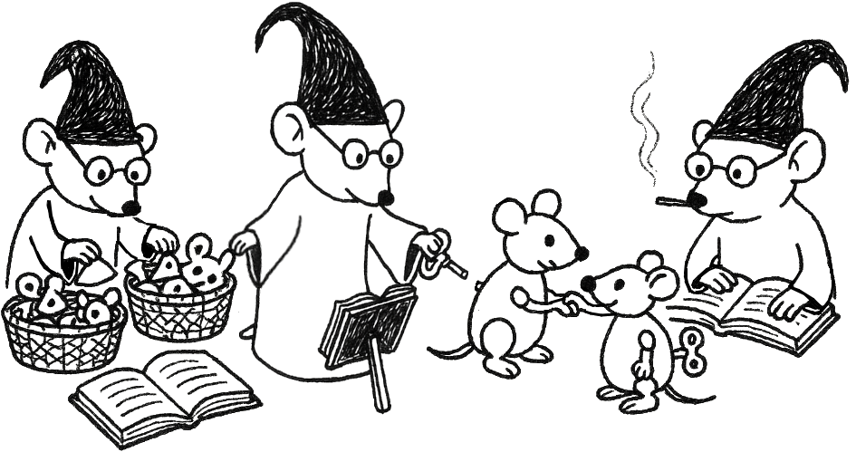

# 👋 UTN - FRP - TUP - Programación 2 - 2025

--

## Programación II - 2025- Documentos, ejemplos y guía de ejercicios 

<em>
  “Las ratonas clasifican, ensamblan y controlan”. Ilustración artística de <a href="https://github.com/MaximaCaceres">Máxima Caceres Alba</a>.
</em>
 

<em>
Representación artística que representa sobre las fases que atraviesa el programador en el proceso de entendimiento del problema. 
Desde las definiciones clasificamos las piezas, a partir de las definiciones tomamos las piezas y ensamblamos  
nuevos objetos, y con la definiciones controlamos que la interacción entre los objetos sean las esperar por sus propias definiciones.
</em>

## Enlaces
[Documentos y guías de ejercicios](https://docs.google.com/document/d/1YewLvEFKFkjCESXEFruTf_HQvazFv_wKD2y6wwtjCfo/preview)

---

## ⚠️ Disclaimer

Todo el contenido publicado en este perfil de GitHub, incluyendo repositorios públicos, es proporcionado con fines educativos y/o de desarrollo.

No me hago responsable por el uso indebido, ilegal o malicioso del código por parte de terceros, ya sea mediante forks, clones o redistribuciones. Cada usuario es responsable de cómo utiliza el código publicado.

Mis proyectos no representan necesariamente la opinión ni están vinculados a ninguna organización con la que colabore o haya colaborado.

---

¡Gracias por visitar mi perfil!
